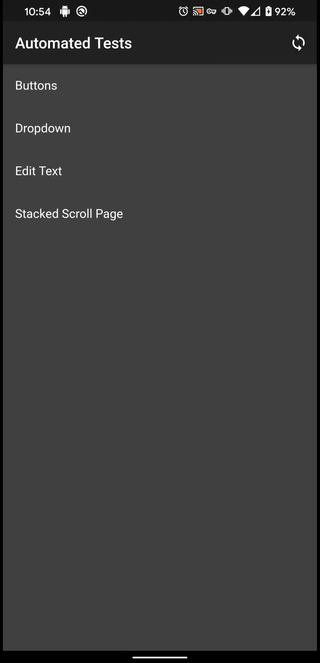

# automated_testing_framework

## Table of Contents

* [Introduction](#introduction)

## Introduction

Automated Testing Framework that allows for the building and executing of automated tests on emulators and / or physical devices.  Unlike the [Flutter Driver](https://api.flutter.dev/flutter/flutter_driver/flutter_driver-library.html), this framework does not require any host driver so it does not have the same limitations.

Via this framework, the application itself is the test driver so it can execute in any circumstance the Flutter application itself can execute.

For users of the Framework, the three most important classes to become familiar with are:

Name | Description
-----|------------
[Testable](https://pub.dev/documentation/automated_testing_framework/latest/widgets/Testable-class.html) | Widget that is used to wrap application level widgets to provide the framework with the ability to interact with it.
[TestRunner](https://pub.dev/documentation/automated_testing_framework/latest/automated_testing_framework/TestRunner-class.html) | Top-level widget that must wrap the application as a whole.  Acts as an owner for the testing framework.
[TestController](https://pub.dev/documentation/automated_testing_framework/latest/automated_testing_framework/TestController-class.html) | Controller that is used to create, edit, load, save, and execute the tests.

## Tests

