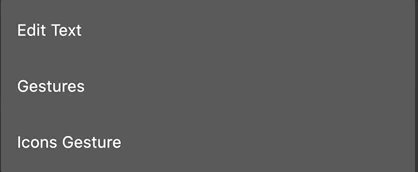
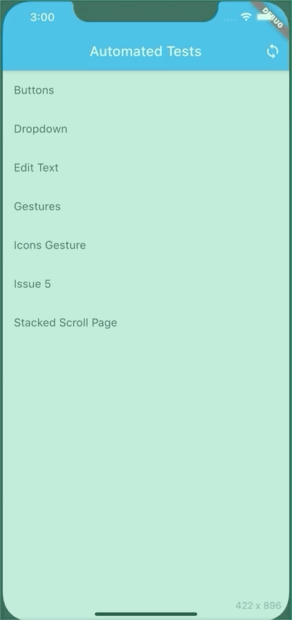
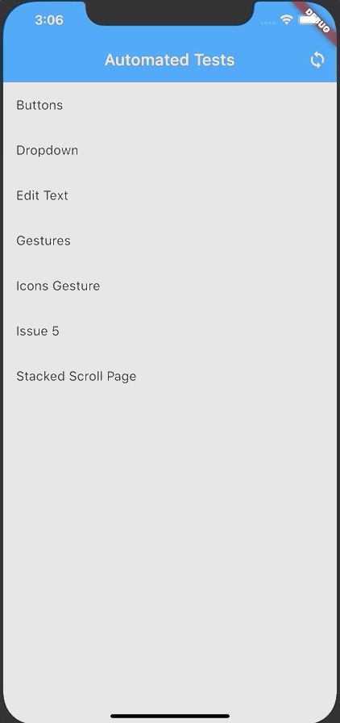
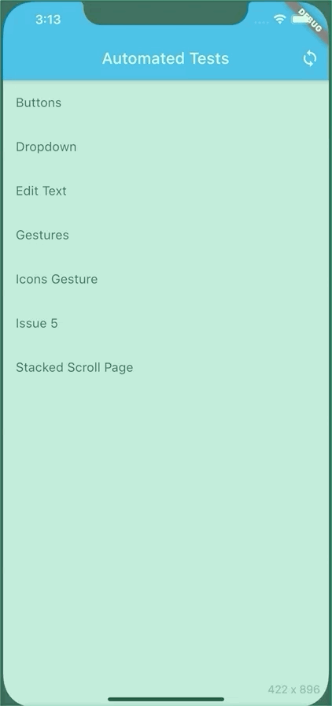
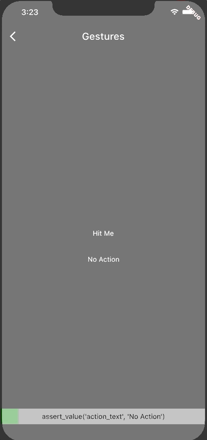
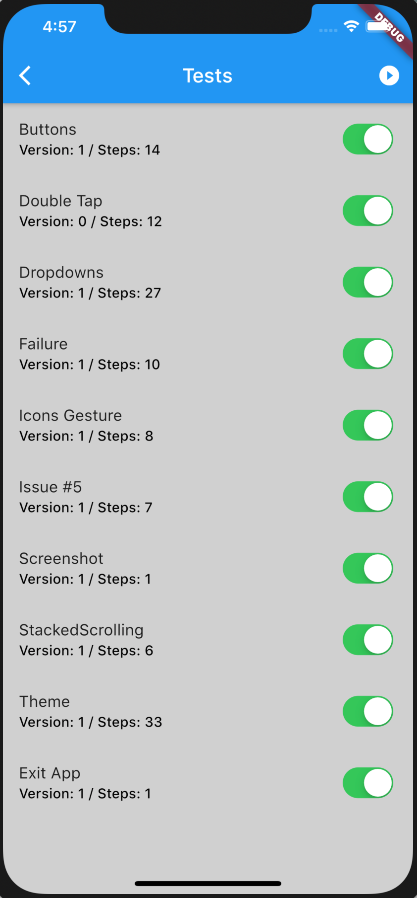

# Building / Running Tests

## Table of Contents

* [Introduction](#introduction)
* [Important Concepts](#important-concepts)
* [Test Steps Dialog](#test-steps-dialog)
* [Test Steps Page](#test-steps-page)
* [View Test Steps Page](#view-test-steps-page)
* [Running Tests](#running-tests)
* [Available Tests Page](#available-tests-page)
* [Test Suite Summary](#test-suite-summary)

## Introduction

The Automated Testing Framework is meant to provide easy ways to both build the tests as well as executing the tests.  Tests can be manually constructed via JSON and then loaded in via a [TestReader](https://pub.dev/documentation/automated_testing_framework/latest/automated_testing_framework/TestReader.html) or built directly within the app.  This document will walk you through the second option; building directly in the app as well as running the tests that you have built.

The intended audience for this document is QA team members, product owners, and developers interested in a UI based solution for building repeatable automated tests that can be executed on any device supported by the application.

Finally, this document describes the default mechanisms for building and running tests.  Applications do have the ability to override these defaults so your specific application may utilize different gestures to trigger the actions described here.

---

## Important Concepts

The testing framework provides end users with two distinct ways for the user to engage with test builder.  It provides direct gestures and indirect gestures.

The direct mechanism happens on the widget itself.  Indirect gestures happen on an overlay widget provided by the framework itself.  Switching the overlay on or off is done via a double tap on the testable widget.

---

## Test Steps Dialog

The Test Steps Dialog can be brought up via a Long Press when the widget does not already support a Long Press gesture (note: Edit Text's support long press so it is known those will never work with this mode).

This dialog provides multiple options to interact with the testing framework.  Tapping one of the steps will add the test step to the current test, but not execute it.  Long Pressing a step will open up the form that allows you to change the defaults for the test step and then add it.  Finally, hitting the Play icon will add the test step and immediately execute it.  This last one is helpful when trying to linearally build a test.

In addition to the adding test steps, there's also the options to navigate to the [View Test Steps Page](#view-test-steps-page) as well as the [Available Tests Page](#available-tests-page).  See those two sections for more details.

---

## Test Steps Page

The Test Steps Page can be brought up via a tap on the overlay described in the [Important Concepts](#important-concepts) section.  To bring up this page, double tap a supported widget to enable the overlay, then tap the overlay.

The Test Steps Page is a more advanced version of the [Test Steps Dialog](#test-steps-dialog).  Everything that can be done in the dialog can also be done here, but this introduces a few differences.

Much like the dialog, hitting the Play icon on a step will both add the step and immediately execute it.  Hitting the Plus icon will add the step using the default values but will not execute it.  The Help icon will provide a description of the step.  Hitting another area of the step will bring up the full form to change any of the defaults.

From here you can hit the "VIEW TEST STEPS" button to open the [View Test Steps Page](#view-test-steps-page).  The Debug icon will bring up the [Available Tests Page](#available-tests-page).

---

## View Test Steps Page

The View Test Steps page can be accessed through either the [Test Steps Dialog](#test-steps-dialog) or the [Test Steps Page](#test-steps-page).  This page will show all the test steps for the test currently being edited.

The top right action icon will switch between "full mode" and "minimized mode" when showing the test steps.  The Clear action will clear all the steps from the current.  The Export will attempt to export / save the current test to whatever system the application is set up with.  The Run All option will reset the application and run all the test steps and the present you with a [Test Report](#test-report) that details the results of the test run.

This page also allows you to edit any particular step's values, delete a step, move steps up or down, or even execute a single step.  When executing a single step, it is executed as-is meaning the framework will pop back to the core application and then execute the step rather than performing a reset in the way that Run All would.

---

## Running Tests

When running the tests, the framework provides the ability to see what's happening while the test is running.  By default, the framework will show an overlay and a progress bar along the bottom of the application.  It will flash the widget about to be interacted with using a semi-transparent yellow indicator so that you can see what it is trying to do or interact with.

It is important to note that you can interact with the application even though a test is running, and it is highly recommended that you do not do that.  The framework cannot block user input while allowing test input so it is possible to break the tests by trying to use the application being tested.

When running a single test, the framework will navigate to the [Test Report](#test-report) page that provides information on the test run.  When running multiple tests via the [Available Tests Page](#available-tests-page), the framework will show the report for each test briefly, and then show a full [Test Suite Summary](#test-suite-summary) at the end.

--- 

## Test Report

The test report will provide an overall status, as well as a per-step pass / fail and the duration the step too.  The durations should be considered application relative and not absolute as they do also include configurable delays that can be set per application.

At the bottom of the test report is a list of all the screenshots that were taken during the test run.  While the framework does show an overlay on top of the application being tested, this over lay is _not_ part of the screenshots captured by the test itself.

It should be noted that screenshots are not currently supported on the Web platform at this time.

---

## Available Tests Page

The Available Tests Page is accessable via either the [Test Steps Dialog](#test-steps-dialog) or [Test Steps Page](#test-steps-page).  It will list all the tests that the application knows how to execute.  It provides an option via the top-right action icon to run all the tests.  Alternatively, individual tests can be enabled or disabled by hitting the switch on the right next to each test.

To load a test into the application mode, long press the test.  That will load the test and make all the steps available to be edited via the [View Test Steps Page](#view-test-steps-page).

When tests are run from the Available Tests Page, the application will show a [Test Report](#test-report) for a configurable amount of time, then move to the next test.  At the very end, the [Test Suite Summary](#test-suite-summary) will be displayed.

---

## Test Suite Summary

The Test Suite Summary will show the results of a full test suite run from either the [Available Tests Pages](#available-tests-page).  The overall pass / fail rate will be at a test level.  For each test, the number of pass vs fail steps will be shown on the right.  Additionally, each test can be tapped to be opened up to show the pass / fail details for each step within the test.

